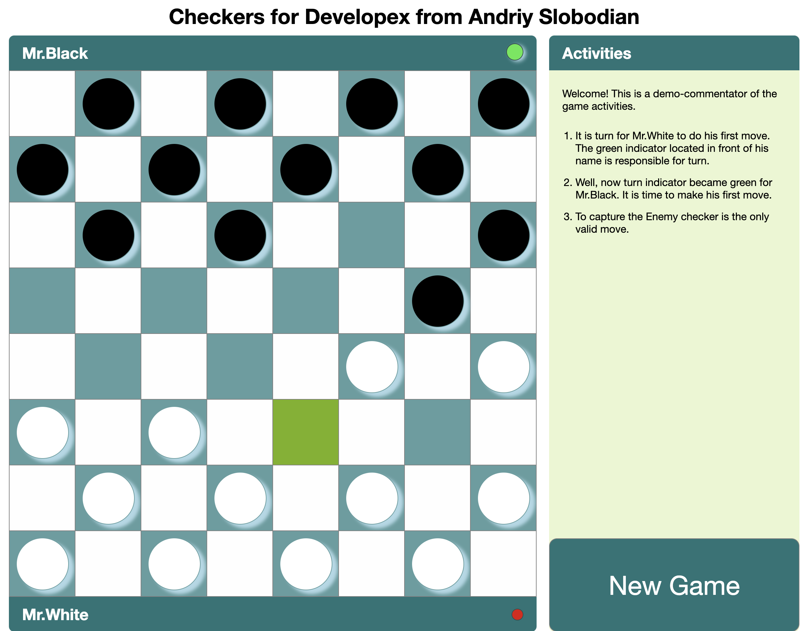

# Checkers
This is a test task for **Developex**

## How to use
1. `Node` + `npm` of the latest version should be installed to your computer
2. Clone the repository `git clone https://github.com/Andriy-Slobodian/checkers.git`
3. Open **checkers** folder `cd checkers`
4. Run `npm install` to install the App dependencies
5. Run `npm start` for the App launch

## Preview

